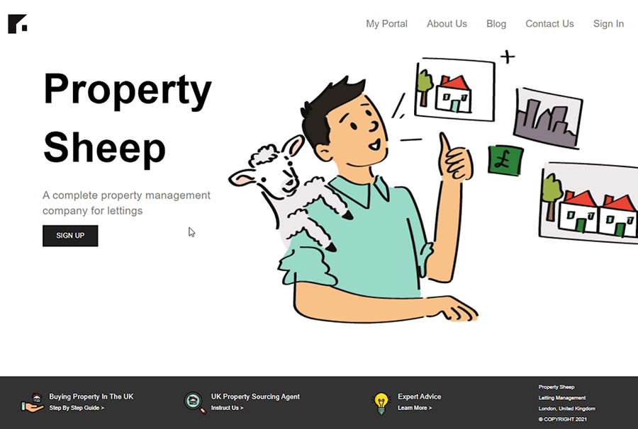

## Property Sheep is a full stack javascript application built for a property letting agency. The site enables landlords to sign up to the service by filling out a questionaire to input all relavant information so their portfolio of properties can be suitably managed by the letting agent. They can then login to the service to securely access their online portal and make any admendments to their account. 

Front end application for Landlords built using React components.
- Landlords can use this site to join the letting agency.
- Authentication and CRUD functionality are handled with JSON web tokens whilst MongoDB is used for storage.
- Once logged in securely, they can enter personal and financial details in order to recieve payment.
- They can .
- They can also register contractors and assign them to their properties.
- Once the Landlord is registered and fully onboarded, they can access their information and make any amendments in their portal.

# Property-Sheep-Server
A Node.js back-end for Property Sheep letting agency site which makes use of a MongoDB database with CRUD functionality. 
Endpoints act as queries to the database which then serve up JSON data to the front-end. 
 

